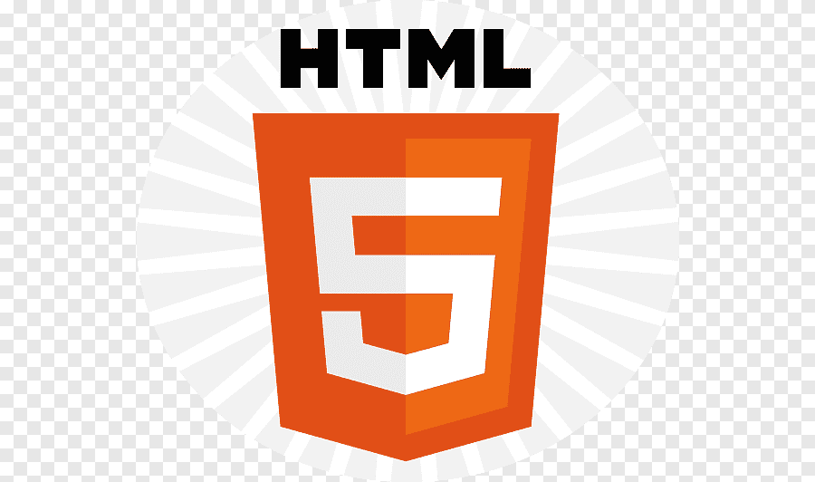
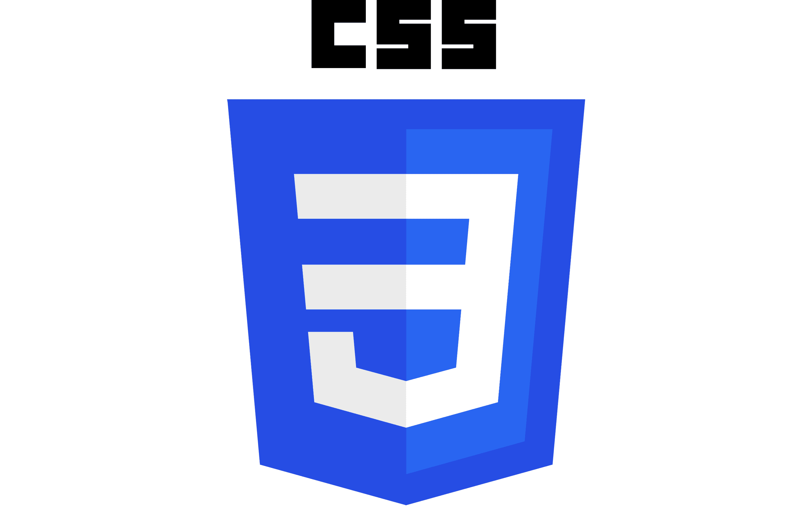
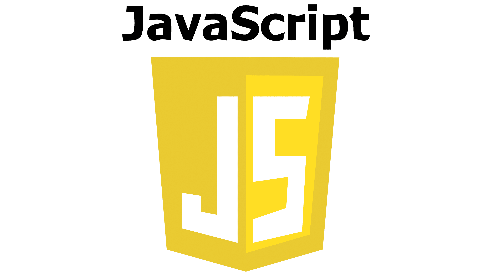

# Code X Gigas - EVENEMENT 

India is a country where every other day events and ceremonies take place,be it wedding,birthday or any kind of parties etc. 

Presenting Evenement, a event management website which deals with the events and ceremonies held all over India.The ultimate moto of our company is to provide every one their desired decorations on their special day.Also through this website people will get to connect with us and we strive to provide them with the best possible service.

## 💭Ideation:
    • There are a lot of events which are held pan-India.There is no centralized system from where customers can contact and get the best decors at best prices.
    • We aim to destroy the monopoly culture of decorators and give every decorators a platform where they can expand their business,be it a small scale or large scale enterprise.
    • The website provides a healthy competition between decorators with various prices and quality of customers which helps them to gain experience regarding proper marketing and also helps the customers choose from a variety of decorators.

## 🧠Usecases:
    • The platform provides a centralized platform where decorators from various area can serve pan India.
    • The platform also serves as a hassle free pages from where they can choose the best decorators available in the market and make their event decor a thing to boast about.
    • Customers can avail the best prices and discounts by registering to our website and thus explore different options.

## 🤯What problems do our project solve:
    • The website puts and end to the monopoly system by putting all the decorators a common platform where they can market their work and earn profit.
    • The website provides a one stop hub to customers looking for a variety of decorations at best prices by searching from their home.
    • Transparency of database and secured payment gateway is acheived.

## 👀Overview
    • On clicking the website link,you land at the landing page where you can see a live video of a happy house party which we have served.
    • In the navbar section,we can look at different parts like Home,About Us,Explore Us, and Sign Up/Login section.
    • In the Explore Us section ,you can get a look of the different services we provide like birthday decors,wedding decors,pre-wedding decors,wedding anniversary decors,patriotic events decors,party decors,festive decors and funeral events decors.
    • We ensure transparency of data and a secured online payment gateway.

## 💀Problems we faced throughout:
    • While connecting the login page and the landing page,we faced a lot of issues.
    • We were also unable to connect the login page with the database,which made it more difficult to work on.
    • We also faced a issue to make the navbar transparent and adjusting the subparts.

## 💥Deployment
    If you wish to visit our website, please click on the following link:
        https://evenement-mainpage-login-da.netlify.app

## 💻Built With:
    •  HTML-for providing a basic structure to the website.
    •  CSS-for providing a catchy design to the website.
    •  Javascript-for providing functionality to the website.

## 🔗 Links
[GitHub Repository Link]

(https://github.com/Dev7478/hack-elite-collab.git)

## ❤️Contributions❤️

Contributions are always welcome!

This project is presented by Team Code X Gigas

Team members - ANUSHKA ROY , ABHIRAJ BOSE

 Team lead : DEBANSHU CHATTERJEE 
 

